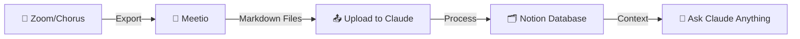
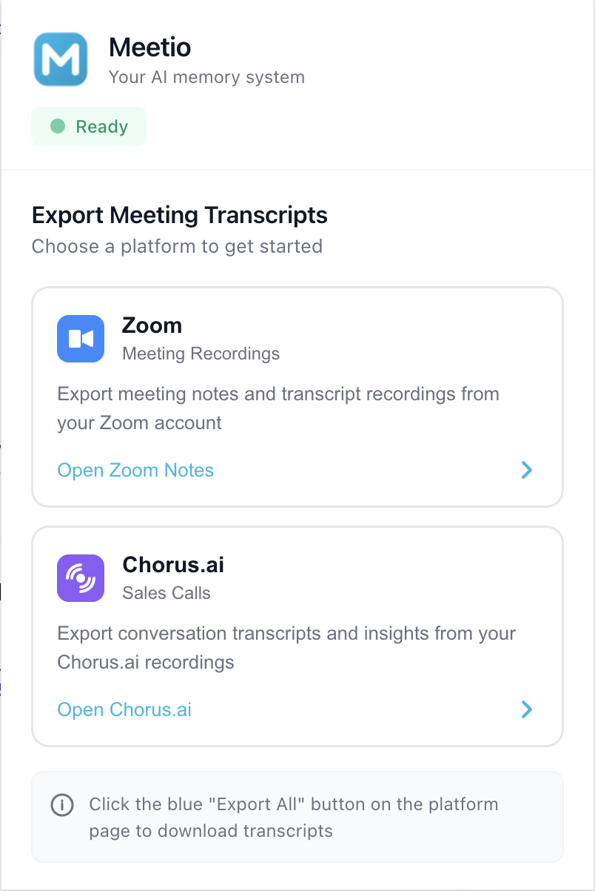

<div align="center">
  
  
  # Meetio
  
  **Your AI memory system for sales engineers**
  
  [](https://github.com/neussie/meetio)
  [](https://harness.io)
  
  Never forget a customer detail again.
  
  [Quick Start](#-quick-start) • [Features](#-features) • [How It Works](#-how-it-works) • [Download Template](./SE_SecondBrain_Notion.zip)
  
</div>

---

## 🎯 The Problem

Sales Engineers are drowning in context:

<table>
<tr>
<td width="25%" align="center">
  <h3>😫</h3>
  <strong>Endless copy-paste</strong><br/>
  Pasting call transcripts into Claude, one at a time
</td>
<td width="25%" align="center">
  <h3>🤯</h3>
  <strong>Too many threads</strong><br/>
  Tens of customers, stakeholders, and meetings to track
</td>
<td width="25%" align="center">
  <h3>🔍</h3>
  <strong>Lost recordings</strong><br/>
  Hunting through Zoom and Chorus wastes precious time
</td>
<td width="25%" align="center">
  <h3>🧠</h3>
  <strong>Claude forgets</strong><br/>
  Context resets every conversation
</td>
</tr>
</table>

## 💡 The Solution

**An AI memory that never forgets a customer**

Meetio turns every Zoom and Chorus call into searchable memory your AI can actually use.

```
📥 Meetio → 🗂️ Notion → 🤖 Claude
```

One hub for every customer conversation. Zero copy-paste. Perfect context every time.

## ✨ Features

<table>
<tr>
<td width="33%">

### 🚀 One-Click Export
Bulk download all your Zoom Notes and Chorus.ai transcripts as clean markdown files

</td>
<td width="33%">

### 🔒 Privacy First
Every transcript is parsed locally in your browser. Nothing leaves your machine.

</td>
<td width="33%">

### 🎯 Zero Config
Install the extension and go. No API keys, no setup, no hassle.

</td>
</tr>
<tr>
<td width="33%">

### 📊 Smart Parsing
Automatically extracts meeting titles, dates, attendees, and conversation flow

</td>
<td width="33%">

### 🔗 Notion Ready
Structured markdown designed for Claude to process into your knowledge base

</td>
<td width="33%">

### 🔄 Extensible
Built for Zoom & Chorus today. Designed for complete automation tomorrow.

</td>
</tr>
</table>

## 🚀 Quick Start

### 1️⃣ Install the Extension

```bash
git clone https://github.com/neussie/meetio.git
cd meetio
```

**Load in Chrome/Edge:**
1. Open `chrome://extensions/`
2. Enable "Developer mode" (top right)
3. Click "Load unpacked"
4. Select the `meetio` folder

### 2️⃣ Set Up Your Notion Workspace

1. **Download the template**: [SE_SecondBrain_Notion.zip](./SE_SecondBrain_Notion.zip)
2. **Import to Notion**: Create a new workspace and import the template
3. **Connect Claude**: Link Claude to your Notion workspace

The template includes:
- 📊 **Customers** database
- 👥 **Stakeholders** database  
- 📝 **Meeting Notes** database
- ✅ **Tasks** tracker

### 3️⃣ Export Your First Transcripts

**For Zoom:**
1. Go to [hub.zoom.us/notes](https://hub.zoom.us/notes)
2. Click the **"📚 Export All Meetings"** button
3. Transcripts download as `.md` files

**For Chorus.ai:**
1. Go to [chorus.ai/home](https://chorus.ai/home)
2. Click the **"📚 Export All Meetings"** button
3. Transcripts download as `.md` files

### 4️⃣ Process with Claude

Upload the markdown files to Claude and ask:

```
Claude, I've exported meeting transcripts. Please read the Notion 
template structure and populate the databases with information from 
these transcripts. Create customer pages, link stakeholders, and 
organize the meeting notes.
```

Claude will:
✅ Parse metadata (dates, attendees, customers)  
✅ Create/update customer pages  
✅ Link stakeholders to meetings  
✅ Organize everything in your Notion workspace  

---

## 🎬 How It Works

<div align="center">

### Three steps. One click. Zero copy-paste.

</div>



1. **Extract** - Meetio bulk-exports your calls as clean markdown
2. **Organize** - Claude processes transcripts into your Notion template
3. **Query** - Ask Claude anything with perfect customer context

---

## 💬 What You Can Ask Claude

Once your transcripts are in Notion, Claude becomes your account intelligence engine:

<table>
<tr>
<td width="50%">

**📄 Generate POV Documents**
```
"Draft a POV for Acme's CI/CD modernization 
from our last three calls"
```

**🎬 Create Demo Scripts**
```
"Write a demo script tailored to what TechCo 
told us they need"
```

</td>
<td width="50%">

**🔄 Build Reverse Demos**
```
"Build a reverse-demo guide for FNZ on the 
security topics Simon raised"
```

**📊 Analyze Accounts**
```
"Summarize top objections across my 
financial-services accounts"
```

</td>
</tr>
</table>

---

## 📸 Screenshots

<div align="center">
  
  <br/>
  <em>Clean, modern extension interface</em>
</div>

---

## 🏗️ Project Structure

```
meetio/
├── icons/                    # Extension icons & logo
├── manifest.json             # Extension configuration
├── popup/                    # Extension popup UI
├── options/                  # Settings page
├── content-scripts/
│   ├── platforms/
│   │   ├── zoom-scraper.js      # Zoom Notes bulk export
│   │   └── chorus-scraper.js    # Chorus.ai bulk export
│   ├── utils.js                 # Shared utilities
│   └── injected-ui.css          # UI styles
├── background/
│   └── service-worker.js        # Background tasks
├── SE_SecondBrain_Notion.zip   # Notion template
└── README.md
```

---

## 🛠️ Development

### Adding New Platforms

Meetio is extensible by design. To add support for new platforms (Gong, Salesloft, etc.):

1. Create `content-scripts/platforms/{platform}-scraper.js`
2. Add to `manifest.json`:
   ```json
   {
     "matches": ["*://platform.com/*"],
     "js": ["content-scripts/utils.js", "content-scripts/platforms/platform-scraper.js"]
   }
   ```
3. Use `window.HarnessExporterUtils` helpers (log, sleep, slugify, downloadFile)

See [zoom-scraper.js](./content-scripts/platforms/zoom-scraper.js) for reference implementation.


---

## 🐛 Troubleshooting

<details>
<summary><strong>Extension button doesn't appear</strong></summary>

- Verify you're on `hub.zoom.us/notes` or `chorus.ai/home`
- Refresh the page
- Check browser console (F12) for errors
- Ensure extension is enabled in `chrome://extensions/`

</details>

<details>
<summary><strong>No transcripts exported</strong></summary>

- Verify meetings have "Meeting Recap" or "Meeting Brief" badges
- Check that you're logged into the platform
- Open browser console to see detailed logs
- Ensure popup blockers aren't blocking downloads

</details>

<details>
<summary><strong>Claude can't find my Notion database</strong></summary>

- Verify Claude has access to your Notion workspace
- Check that the template was imported correctly
- Ensure database sharing settings allow Claude access

</details>

---

## 🎯 Why Meetio?

<table>
<tr>
<td width="50%">

### Built by an SE, for SEs
Solves the workflow we live every day. No guesswork.

### Fills the Granola Gap
Meeting intelligence that legal can actually approve - local, controlled, ours.

### Compounds Over Time
Every meeting makes your AI a little smarter. Your knowledge base grows automatically.

</td>
<td width="50%">

### Zero Config, One Click
Install and go. No API keys, no webhooks, no setup.

### Privacy First
Everything parsed locally. Nothing sent to third parties.

### Extensible by Design
Zoom and Chorus today. Complete automation next.

</td>
</tr>
</table>

---

## 💡 Pro Tips

- 📅 **Export weekly**: Make it a Friday ritual to export the week's meetings
- 🏷️ **Tag strategically**: Use Notion tags for deal stages (POV, POC, Production)
- 🔗 **Link stakeholders**: Connect attendees to stakeholder profiles for relationship mapping
- 🎯 **Be specific**: Reference customer names, dates, or topics when asking Claude

---

## 📄 License

MIT License - see [LICENSE](./LICENSE) for details

---

## 👤 Author

**Neus Samir Escruela**  
Solutions Engineer @ Harness.io

- Email: neus.escruela@harness.io
- GitHub: [@neussie](https://github.com/neussie)

---


<div align="center">
  
  **Never forget a customer detail again.**
  
  ⭐ Star this repo if Meetio helps you ship faster!
  
  [Get Started](#-quick-start)
  
</div>

---

<sub>This extension is not affiliated with or endorsed by Zoom Video Communications, Inc., Chorus.ai, or Notion Labs, Inc.</sub>
